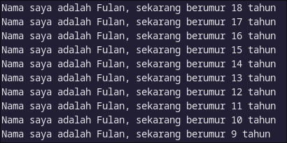

## Pertemuan 2

### Nama : Syahrul Bhudi Ferdiansyah

### Kelas : TI - 3B / 26

1. Modefikasi baris 3 di Vs Code atau Editor Code favorit Anda berikut ini agar mendapatkan keluaran (output) sesuai yang diminta

```dart
void main(){
    for(int i = 0; i < 10; i++){
        print('hello $(i+2)')
    }
}
```

Output yang diminta

```dart
void main() {
  for (int i = 18; i >= 9; i--) {
    print("Nama saya adalah Fulan, sekarang berumur $i tahun");
  }
}
```



2. Mengapa sangat penting untuk memahami bahasa pemrograman Dart sebelum kita menggunakan framework Flutter ? Jelaskan !

   > Jawaban : Karena Flutter dibangun menggunakan bahasa dart, sehingga penguasaan Dart memastikan penulisan kode yang efektif dan memudahkan pemahaman terhadap konsep-konsep dasar Flutter seperti widget, async programming, state management.

3. Rangkumlah materi dari codelab ini menjadi poin-poin penting yang dapat Anda gunakan untuk membantu proses pengembangan aplikasi mobile menggunakan framework Flutter
   > Jawaban : <br>
   > a. Framework (kerangka kerja) adalah sebuah kerangka program yang digunakan untuk membantu developer dalam mengembangkan kode secara konsisten. Adanya framework developer bisa mengurangi jumlah bug pada aplikasi yang dibuat. Karena, fungsi dan variabel yang sudah tersedia di dalam komponen framework tersebut.<br><br>
   > b. Git adalah salah satu sistem pengontrol versi (Version Control System) pada proyek perangkat lunak. <br><br>
   > c. Flutter adalah sebuah framework open source yang dibuat oleh Google. Google membuat flutter dengan tujuan membangun sebuah framework untuk membuat UI yang modern, native dan reactive yang dapat berjalan di sistem operasi iOS maupun Android. <br><br>
   > d. Gaya pengembangan aplikasi menggunakan flutter sedikit berbeda dengan gaya pengembangan aplikasi pada umumnya, di mana UI pada flutter dibuat menggunakan Widget. Widget adalah sebuah konsep dimana UI dapat dianggap sebagai sebuah balok LEGO, sebuah bentuk baru dapat disusun dari beberapa balok dan masing masing kumpulan balok dapat dikombinasikan dengan kumpulan balok lain sehingga membentuk sebuah bentuk baru yang lebih kompleks. <br><br>
   > e. Flutter memiliki dua jenis widget yaitu StatelessWidget dan StatefullWidget. Stateless widget digunakan ketika value (state / konfigurasi) dari widget tersebut tidak pernah berubah, dan StatefullWidget digunakan ketika value (state / konfigurasi) dari widget dapat berubah. <br><br>
   > f. Bahasa Dart adalah inti dari framework Flutter. <br><br>
   > g. Dart dan Flutter dibentuk menggunakan pattern penulisan OOP <br><br>
   > h. Kompilasi JIT adalah tempat kode sumber dikompilasi sesuai kebutuhan—Just in time. Dart VM memuat dan mengkompilasi kode sumber ke kode mesin asli (native). Pendekatan ini digunakan untuk menjalankan kode pada command line atau selama proses pengembangan aplikasi mobile yang dapat memanfaatkan fitur seperti debugging dan hot reload.<br><br>
   > i. Kompilasi AOT adalah dimana Dart VM dan kode Anda dikompilasi sebelumnya, VM bekerja lebih seperti sistem runtime Dart, yang menyediakan garbage collector dan metode-metode native dari Dart software development kit (SDK) pada aplikasi. Pendekatan ini memiliki keuntungan performa yang sangat besar dibandingkan kompilasi JIT, tetapi fitur lain seperti debugging dan hot reload tidak tersedia.<br><br>
   > j. Dart menggunakan function dan method sebagai cara untuk memisahkan kode. Sebuah function atau method adalah potongan kode yang menerima beberapa data, eksekusi kode, dan kemudian mengembalikan beberapa data (return).<br><br>
   > k. main function merupakan kode awal yang dieksekusi oleh Dart VM
