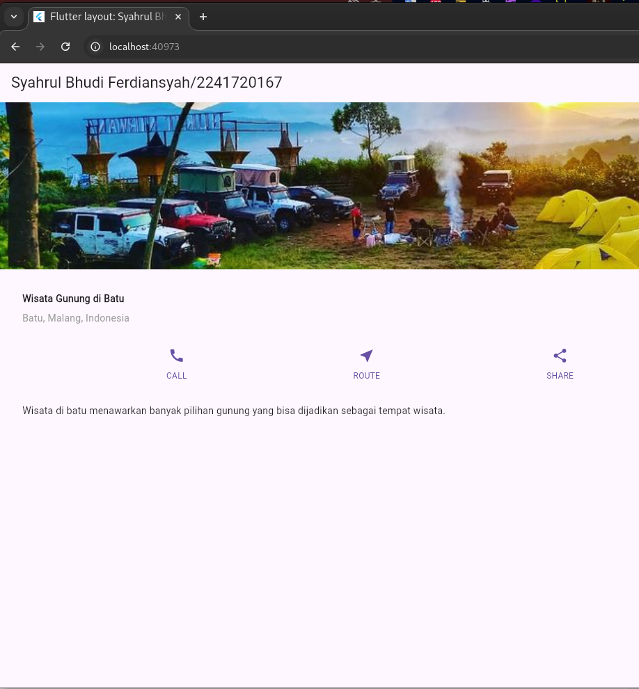
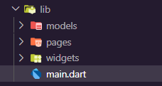
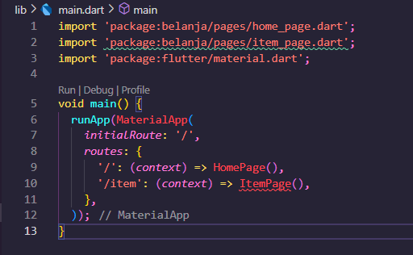
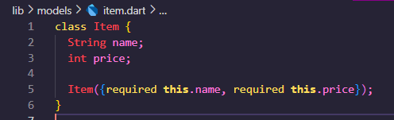
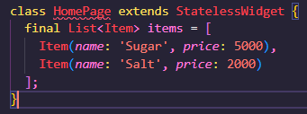
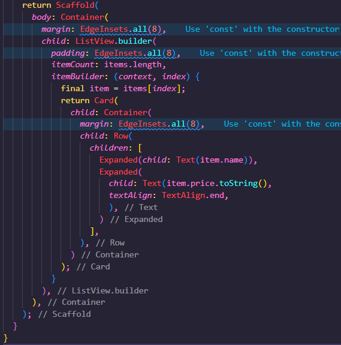
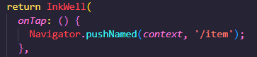
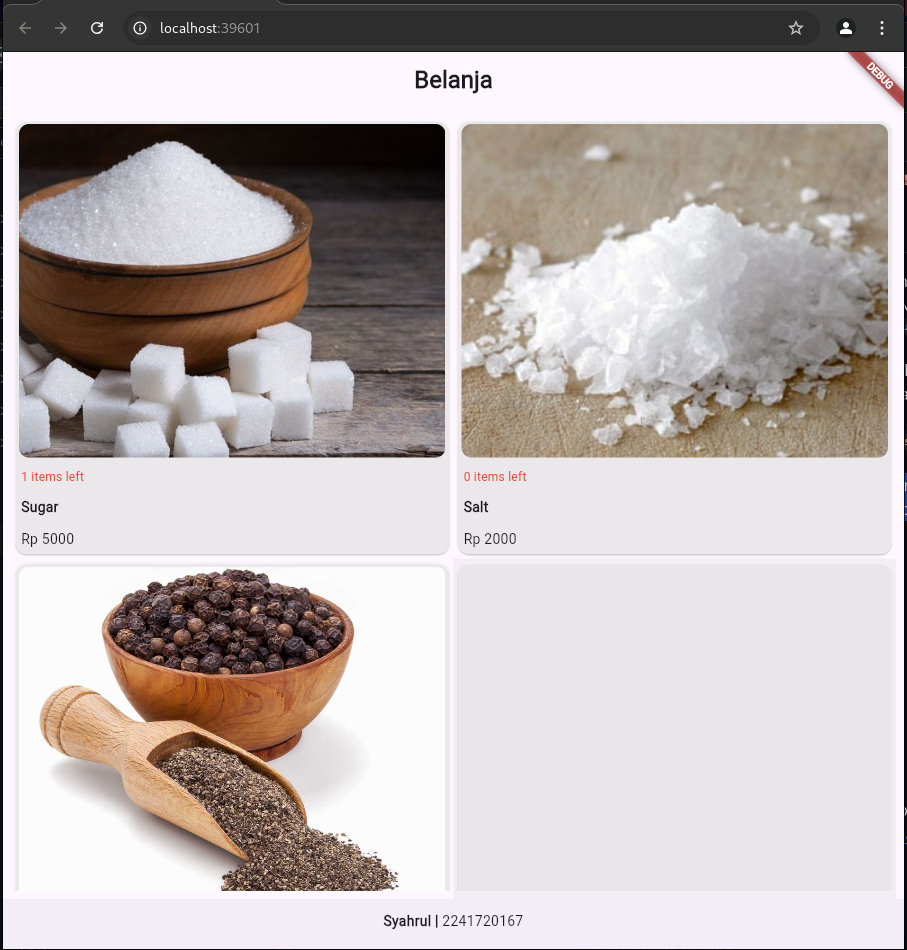

# 06 | Layout dan Navigasi

> Nama :Syahrul Bhudi Ferdiansyah

> Kelas :TI - 3B

> Absen :26

## Praktikum 1: Membangun Layout di Flutter

1. Buat Project Baru
   
2. Buka file lib/main.dart

```dart
import 'package:flutter/material.dart';

void main() => runApp(const MyApp());

class MyApp extends StatelessWidget {
  const MyApp({super.key});

  @override
  Widget build(BuildContext context) {
    return MaterialApp(
      title: 'Flutter layout: Syahrul Bhudi Ferdiansyah 2241720167',
      home: Scaffold(
        appBar: AppBar(
          title: const Text('Flutter layout demo'),
        ),
        body: const Center(
          child: Text('Hello World'),
        ),
      ),
    );
  }
}
```

3. Implementasi title row

```dart
  final Widget titleSection = Container(
    padding: const EdgeInsets.all(32.0),
    child: Row(
      children: [
        Expanded(
          /* soal 1*/
          child: Column(
            crossAxisAlignment: CrossAxisAlignment.start,
            children: [
              /* soal 2*/
              Container(
                padding: const EdgeInsets.only(bottom: 8.0),
                child: const Text(
                  'Wisata Gunung di Batu',
                  style: TextStyle(
                    fontWeight: FontWeight.bold,
                  ),
                ),
              ),
              const Text(
                'Batu, Malang, Indonesia',
                style: TextStyle(color: Colors.grey),
              ),
            ],
          ),
        ),
        /* soal 3*/
        const Icon(Icons.star, color: Colors.red),
        const Text('41'),
      ],
    ),
  );
```

> Code diatas adalah code yang digunakan untuk membuat title row

4. Tambahkan title section ke body

```dart
    return MaterialApp(
      title: 'Flutter layout: Syahrul Bhudi Ferdiansyah 2241720167',
      home: Scaffold(
        appBar: AppBar(
          title: const Text('Flutter layout demo'),
        ),
        body: Column(
          children: [
            titleSection
          ],
        ),
      ),
    );
  }
}
```

## Praktikum 2: Implementasi button row

1. Buat method Column \_buildButtonColumn

```dart
 Column _buildButtonColumn(Color color, IconData icon, String label) {
    return Column(
      mainAxisSize: MainAxisSize.min,
      mainAxisAlignment: MainAxisAlignment.center,
      children: [
        Icon(icon, color: color),
        Container(
          margin: const EdgeInsets.only(top: 8),
          child: Text(
            label,
            style: TextStyle(
              fontSize: 12,
              fontWeight: FontWeight.w400,
              color: color,
            ),
          ),
        ),
      ],
    );
```

2. Buat widget buttonSection

```dart
Color color = Theme.of(context).primaryColor;

Widget buttonSection = Row(
  mainAxisAlignment: MainAxisAlignment.spaceEvenly,
  children: [
    _buildButtonColumn(color, Icons.call, 'CALL'),
    _buildButtonColumn(color, Icons.near_me, 'ROUTE'),
    _buildButtonColumn(color, Icons.share, 'SHARE'),
  ],
);
```

3.Tambah button section ke body

```dart
    return MaterialApp(
      title: 'Flutter layout: Syahrul Bhudi Ferdiansyah 2241720167',
      home: Scaffold(
        appBar: AppBar(
          title: const Text('Flutter layout demo'),
        ),
        body: Column(
          children: [
            titleSection,
            buttonSection,
          ],
        ),
      ),
    );
  }
```

## Praktikum 3: Implementasi text section

1. Buat widget textSection

```dart
 Widget textSection = Container(
    padding: const EdgeInsets.all(32),
    child: const Text(
      'Wisata di batu menawarkan banyak pilihan gunung yang bisa dijadikan sebagai tempat wisata. ',
      softWrap: true,
    ),
  );
```

2. Tambahkan variabel text section ke body

```dart
        body: Column(
          children: [
            titleSection,
            buttonSection,
            textSection
          ],
        ),
```

## Praktikum 4: Implementasi image section

1. Siapkan aset gambar

```yaml
assets:
  - assets/images
```

2. Tambahkan gambar ke body

```dart
          children: [
            Image.asset(
              '/images/image.png',
              width: 600,
              height: 240,
              fit: BoxFit.cover,
            ),
            titleSection,
            buttonSection,
            textSection
          ],
```

3. Terakhir, ubah menjadi ListView

```dart
        body: ListView(
          children: [
            Image.asset(
              '/images/image.png',
              width: 600,
              height: 240,
              fit: BoxFit.cover,
            ),
            titleSection,
            buttonSection,
            textSection
          ],
        ),
```



## Tugas Praktikum 1


## Membangun Navigasi di Flutter

## Langkah 1



## Langkah 2


## Langkah 3



## Langkah 4



## Langkah 5



## Langkah 6



## Langkah 7



## Tugas Praktikum 2

1. Untuk melakukan pengiriman data ke halaman berikutnya, cukup menambahkan informasi arguments pada penggunaan Navigator. Perbarui kode pada bagian Navigator menjadi seperti berikut.

```dart
Navigator.pushNamed(context, '/item', arguments: item);
```

2. Pembacaan nilai yang dikirimkan pada halaman sebelumnya dapat dilakukan menggunakan ModalRoute. Tambahkan kode berikut pada blok fungsi build dalam halaman ItemPage. Setelah nilai didapatkan, anda dapat menggunakannya seperti penggunaan variabel pada umumnya. (https://docs.flutter.dev/cookbook/navigation/navigate-with-arguments)

```dart
final itemArgs = ModalRoute.of(context)!.settings.arguments as Item;
```

3 dan 4 <br>


5. Selesaikan Praktikum 5: Navigasi dan Rute tersebut. Cobalah modifikasi menggunakan plugin go_router, lalu dokumentasikan dan push ke repository Anda berupa screenshot setiap hasil pekerjaan beserta penjelasannya di file README.md. Kumpulkan link commit repository GitHub Anda kepada dosen yang telah disepakati!

```dart
import 'package:belanja/models/item.dart';
import 'package:belanja/pages/home_page.dart';
import 'package:belanja/pages/item_page.dart';
import 'package:flutter/material.dart';
import 'package:go_router/go_router.dart';

void main() {
  runApp(
    MaterialApp.router(
      routerConfig: GoRouter(
        routes: [
          GoRoute(
            path: '/',
            builder: (context, state) {
              return const HomePage();
            },
          ),
          GoRoute(
            path: '/item',
            builder: (context, state) {
              final item = state.extra as Item;
              return ItemPage(itemArgs: item);
            },
          ),
        ],
      ),
    ),
  );
}
```
