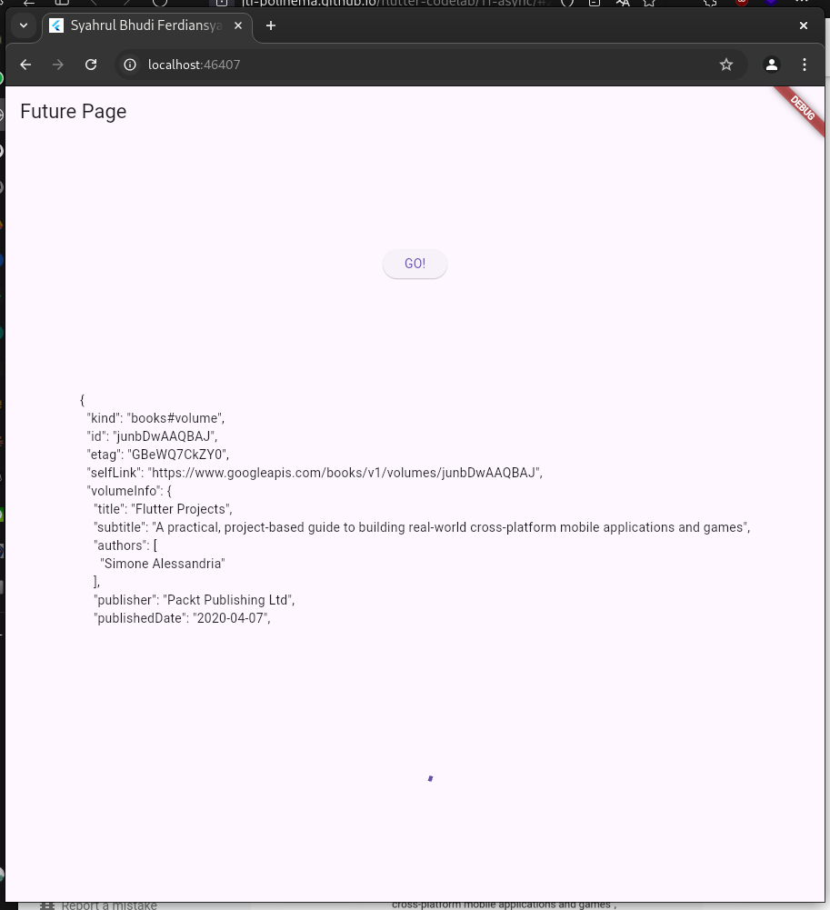
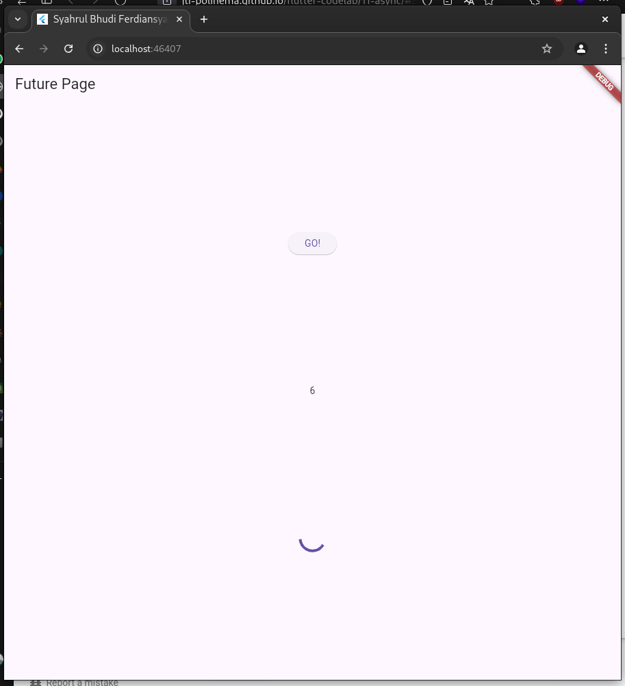
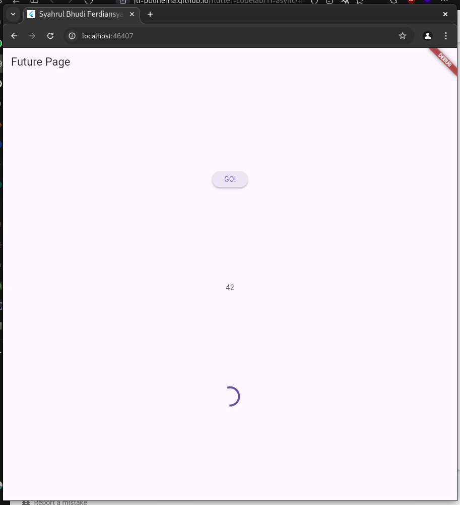
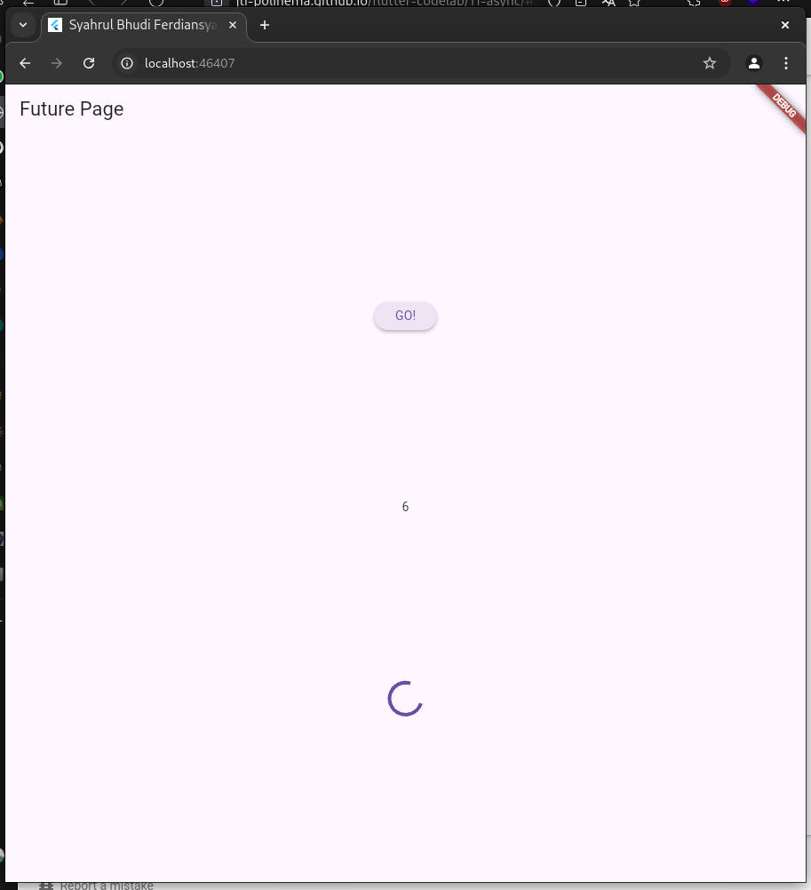

# 11 | Pemrograman Asynchronous

> Nama : Syahrul Bhudi Ferdiansyah

> Kelas : TI - 3B

> Absen : 26

## Praktikum 1: Mengunduh Data dari Web Service (API)

1. Add packgae
   
2. Soal 1
   Tambahkan nama panggilan Anda pada title app sebagai identitas hasil pekerjaan Anda.

```dart
import 'dart:async';

import 'package:flutter/material.dart';

void main() {}

class MyApp extends StatelessWidget {
  const MyApp({super.key});

  @override
  Widget build(BuildContext context) {
    return MaterialApp(
      title: 'Syahrul Bhudi Ferdiansyah',
      theme: ThemeData(
          primarySwatch: Colors.blue,
          visualDensity: VisualDensity.adaptivePlatformDensity),
      home: const FuturePage(),
    );
  }
}

class FuturePage extends StatefulWidget {
  const FuturePage({Key key}) : super(key: key);

  @override
  // ignore: library_private_types_in_public_api
  _FuturePageState createState() => _FuturePageState();
}

class _FuturePageState extends State<FuturePage> {
  String result = '';
  @override
  Widget build(BuildContext context) {
    return Scaffold(
      appBar: AppBar(
        title: const Text('Future Page'),
      ),
      body: Center(
        child: Column(
          children: [
            const Spacer(),
            ElevatedButton(onPressed: () {}, child: const Text('GO!')),
            const Spacer(),
            Text(result),
            const Spacer(),
            const CircularProgressIndicator(),
            const Spacer(),
          ],
        ),
      ),
    );
  }
}
```

3. Tambah method getData()

```dart
Future<Response> getData() async {
    const authority = 'www.googleapis.com';
    const path = '/books/v1/volumes/junbDwAAQBAJ';
    Uri uri = Uri.https(authority, path);
    return http.get(uri);
  }
```

> Soal 2 mencari id buku ; iQmPNDIAskUC

4. Tambah kode di ElevatedButton

```dart
ElevatedButton(
                onPressed: () {
                  setState(() {});
                  getData().then((value) {
                    setState(() {
                      result = value.body.toString().substring(0, 450);
                      setState(() {});
                    });
                  }).catchError((_) {
                    result = 'Error';
                    setState(() {});
                  });
                },
                child: const Text('GO!')),
```

> Soal 3

    Jelaskan maksud kode langkah 5 tersebut terkait substring dan catchError!
    Capture hasil praktikum Anda berupa GIF dan lampirkan di README. Lalu lakukan commit dengan pesan "W11: Soal 3".

> Substring digunakan untuk mengambil 450 kata pertama, Catch Error digunakan untuk menghandle jika terjadi error saat request

- Hasil
  

## Praktikum 2: Menggunakan await/async untuk menghindari callbacks

1. Tambahkan kode

```dart
 Future<int> returnOneAsync() async {
    await Future.delayed(const Duration(seconds: 3));
    return 1;
  }

  Future<int> returnTwoAsync() async {
    await Future.delayed(const Duration(seconds: 3));
    return 2;
  }

  Future<int> returnThreeAsync() async {
    await Future.delayed(const Duration(seconds: 3));
    return 3;
  }
```

2. Tambahkan method count()

```dart
Future count() async {
    int total = 0;
    total = await returnOneAsync();
    total += await returnTwoAsync();
    total += await returnThreeAsync();
    setState(() {
      result = total.toString();
    });
  }
```

3.Panggil count()

```dart
onPressed:(){
  count();
}
```

4. RUN
   

## Praktikum 3: Menggunakan Completer di Future

1. Tambahkan kode

```dart
 late Completer completer;

  Future getNumber() {
    completer = Completer<int>();
    calculate();
    return completer.future;
  }

  Future calculate() async {
    await Future.delayed(const Duration(seconds: 5));
    completer.complete(42);
  }
```

2. Ganti Onpressed

```dart
getNumber().then((value) {
                    setState(() {
                      result = value.toString();
                    });
                  });
```

3. RUN
   

> Soal 5 Jelaskan maksud kode langkah 2 tersebut!
> Kode tersebut menggunakan **`Completer`** untuk mengontrol penyelesaian sebuah `Future` secara manual. Fungsi `getNumber` mengembalikan sebuah `Future`, yang akan diselesaikan oleh fungsi `calculate` setelah menunda selama 5 detik dengan nilai 42.

4.  Ganti kode

```dart
Future calculate() async {
    // await Future.delayed(const Duration(seconds: 5));
    // completer.complete(42);

    try {
      await new Future.delayed(const Duration(seconds: 5));
      completer.complete(42);
    } catch (_) {
      completer.completeError({});
    }
  }
```

5. Pindah onpressed

```dart
getNumber().then((value) {
                    setState(() {
                      result = value.toString();
                    });
                  }).catchError((e){
                    result = 'Error';
                  });
                },
```

> Soal 6 perbedaan
> Perbedaan utamanya adalah versi pertama tidak memiliki penanganan error, sehingga jika terjadi kegagalan, `Completer` tidak menyelesaikan `Future`. Versi kedua menggunakan `try-catch` untuk menangkap error, sehingga `Completer` dapat menyelesaikan `Future` dengan error menggunakan `completeError`.

- Hasil
  

## Praktikum 4: Memanggil Future secara paralel

1. gunakan group

```dart
  void returnFG() {
    FutureGroup<int> futureGroup = FutureGroup<int>();
    futureGroup.add(returnOneAsync());
    futureGroup.add(returnTwoAsync());
    futureGroup.add(returnThreeAsync());
    futureGroup.close();
    futureGroup.future.then((List<int> value) {
      int total = 0;
      for (var element in value) {
        total += element;
      }
      setState(() {
        result = total.toString();
      });
    });
  }
```

2. edit onPressed()

```dart
returnFG();
```

- Hasil
  

3. Ganti variabel futureGroup

```dart
final futures = Future.wait<int>([
  returnOneAsync(),
  returnTwoAsync(),
  returnThreeAsync(),
]);
```

> Soal 8 perbedaannya
Perbedaan utamanya adalah **`Future.wait`** langsung mengelola kumpulan `Future` secara bersamaan dan menghasilkan hasilnya ketika semuanya selesai. Sementara itu, **`FutureGroup`** memberikan fleksibilitas untuk menambahkan `Future` secara dinamis sebelum ditutup, cocok untuk skenario di mana jumlah `Future` tidak diketahui sebelumnya.
