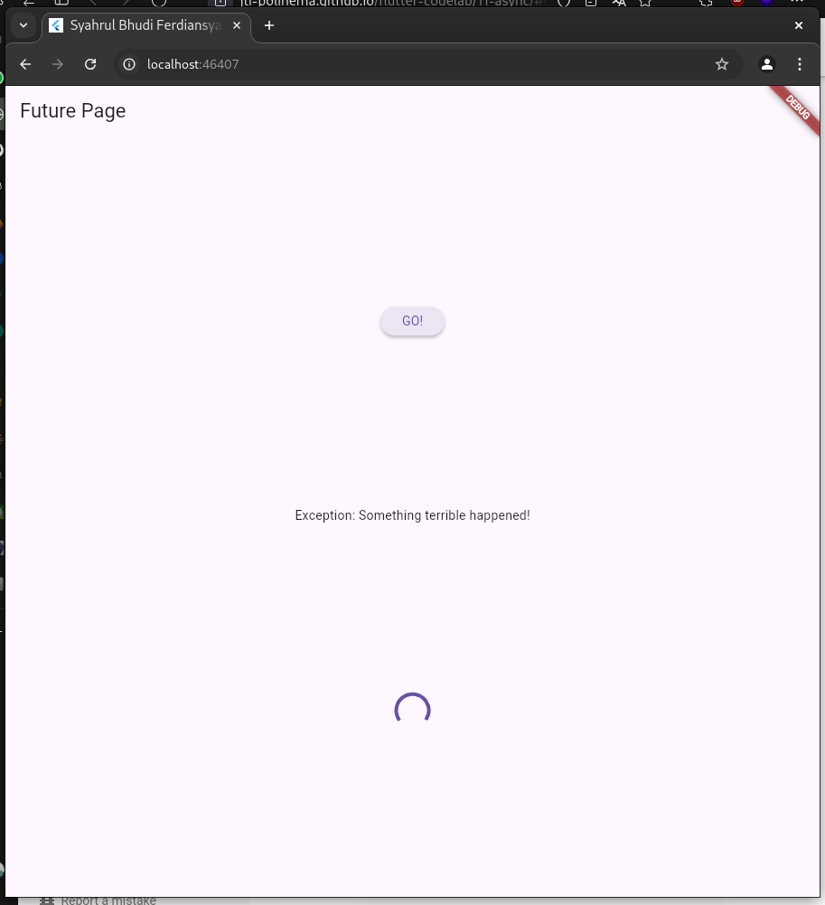
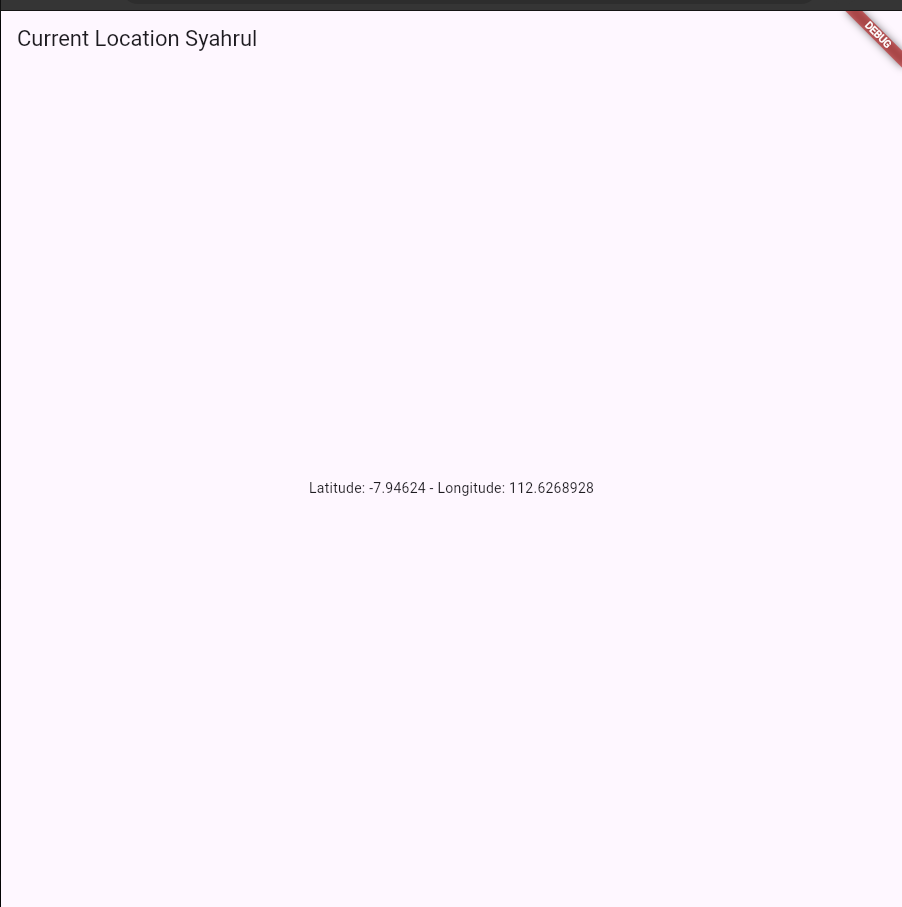

# 11 | Pemrograman Asynchronous

> Nama : Syahrul Bhudi Ferdiansyah

> Kelas : TI - 3B

> Absen : 26

## Praktikum 1: Mengunduh Data dari Web Service (API)

1. Add packgae
   
2. Soal 1
   Tambahkan nama panggilan Anda pada title app sebagai identitas hasil pekerjaan Anda.

```dart
import 'dart:async';

import 'package:flutter/material.dart';

void main() {}

class MyApp extends StatelessWidget {
  const MyApp({super.key});

  @override
  Widget build(BuildContext context) {
    return MaterialApp(
      title: 'Syahrul Bhudi Ferdiansyah',
      theme: ThemeData(
          primarySwatch: Colors.blue,
          visualDensity: VisualDensity.adaptivePlatformDensity),
      home: const FuturePage(),
    );
  }
}

class FuturePage extends StatefulWidget {
  const FuturePage({Key key}) : super(key: key);

  @override
  // ignore: library_private_types_in_public_api
  _FuturePageState createState() => _FuturePageState();
}

class _FuturePageState extends State<FuturePage> {
  String result = '';
  @override
  Widget build(BuildContext context) {
    return Scaffold(
      appBar: AppBar(
        title: const Text('Future Page'),
      ),
      body: Center(
        child: Column(
          children: [
            const Spacer(),
            ElevatedButton(onPressed: () {}, child: const Text('GO!')),
            const Spacer(),
            Text(result),
            const Spacer(),
            const CircularProgressIndicator(),
            const Spacer(),
          ],
        ),
      ),
    );
  }
}
```

3. Tambah method getData()

```dart
Future<Response> getData() async {
    const authority = 'www.googleapis.com';
    const path = '/books/v1/volumes/junbDwAAQBAJ';
    Uri uri = Uri.https(authority, path);
    return http.get(uri);
  }
```

> Soal 2 mencari id buku ; iQmPNDIAskUC

4. Tambah kode di ElevatedButton

```dart
ElevatedButton(
                onPressed: () {
                  setState(() {});
                  getData().then((value) {
                    setState(() {
                      result = value.body.toString().substring(0, 450);
                      setState(() {});
                    });
                  }).catchError((_) {
                    result = 'Error';
                    setState(() {});
                  });
                },
                child: const Text('GO!')),
```

> Soal 3

    Jelaskan maksud kode langkah 5 tersebut terkait substring dan catchError!
    Capture hasil praktikum Anda berupa GIF dan lampirkan di README. Lalu lakukan commit dengan pesan "W11: Soal 3".

> Substring digunakan untuk mengambil 450 kata pertama, Catch Error digunakan untuk menghandle jika terjadi error saat request

- Hasil
  

## Praktikum 2: Menggunakan await/async untuk menghindari callbacks

1. Tambahkan kode

```dart
 Future<int> returnOneAsync() async {
    await Future.delayed(const Duration(seconds: 3));
    return 1;
  }

  Future<int> returnTwoAsync() async {
    await Future.delayed(const Duration(seconds: 3));
    return 2;
  }

  Future<int> returnThreeAsync() async {
    await Future.delayed(const Duration(seconds: 3));
    return 3;
  }
```

2. Tambahkan method count()

```dart
Future count() async {
    int total = 0;
    total = await returnOneAsync();
    total += await returnTwoAsync();
    total += await returnThreeAsync();
    setState(() {
      result = total.toString();
    });
  }
```

3.Panggil count()

```dart
onPressed:(){
  count();
}
```

4. RUN
   

## Praktikum 3: Menggunakan Completer di Future

1. Tambahkan kode

```dart
 late Completer completer;

  Future getNumber() {
    completer = Completer<int>();
    calculate();
    return completer.future;
  }

  Future calculate() async {
    await Future.delayed(const Duration(seconds: 5));
    completer.complete(42);
  }
```

2. Ganti Onpressed

```dart
getNumber().then((value) {
                    setState(() {
                      result = value.toString();
                    });
                  });
```

3. RUN
   

> Soal 5 Jelaskan maksud kode langkah 2 tersebut!
> Kode tersebut menggunakan **`Completer`** untuk mengontrol penyelesaian sebuah `Future` secara manual. Fungsi `getNumber` mengembalikan sebuah `Future`, yang akan diselesaikan oleh fungsi `calculate` setelah menunda selama 5 detik dengan nilai 42.

4.  Ganti kode

```dart
Future calculate() async {
    // await Future.delayed(const Duration(seconds: 5));
    // completer.complete(42);

    try {
      await new Future.delayed(const Duration(seconds: 5));
      completer.complete(42);
    } catch (_) {
      completer.completeError({});
    }
  }
```

5. Pindah onpressed

```dart
getNumber().then((value) {
                    setState(() {
                      result = value.toString();
                    });
                  }).catchError((e){
                    result = 'Error';
                  });
                },
```

> Soal 6 perbedaan
> Perbedaan utamanya adalah versi pertama tidak memiliki penanganan error, sehingga jika terjadi kegagalan, `Completer` tidak menyelesaikan `Future`. Versi kedua menggunakan `try-catch` untuk menangkap error, sehingga `Completer` dapat menyelesaikan `Future` dengan error menggunakan `completeError`.

- Hasil
  

## Praktikum 4: Memanggil Future secara paralel

1. gunakan group

```dart
  void returnFG() {
    FutureGroup<int> futureGroup = FutureGroup<int>();
    futureGroup.add(returnOneAsync());
    futureGroup.add(returnTwoAsync());
    futureGroup.add(returnThreeAsync());
    futureGroup.close();
    futureGroup.future.then((List<int> value) {
      int total = 0;
      for (var element in value) {
        total += element;
      }
      setState(() {
        result = total.toString();
      });
    });
  }
```

2. edit onPressed()

```dart
returnFG();
```

- Hasil
  

3. Ganti variabel futureGroup

```dart
final futures = Future.wait<int>([
  returnOneAsync(),
  returnTwoAsync(),
  returnThreeAsync(),
]);
```

> Soal 8 perbedaannya
> Perbedaan utamanya adalah **`Future.wait`** langsung mengelola kumpulan `Future` secara bersamaan dan menghasilkan hasilnya ketika semuanya selesai. Sementara itu, **`FutureGroup`** memberikan fleksibilitas untuk menambahkan `Future` secara dinamis sebelum ditutup, cocok untuk skenario di mana jumlah `Future` tidak diketahui sebelumnya.

## Praktikum 5: Menangani Respon Error pada Async Code

1. tambahkan kode

```dart
Future returnError() async {
    await Future.delayed(const Duration(seconds: 3));
    throw Exception('Something terrible happened!');
  }
```

2. ganti onPressed

````dart
returnError().then((value) {
                    setState(() {
                      result = 'success';
                    });
                  }).catchError((e) {
                    setState(() {
                      result =  e.toString();
                    });
                  }).whenComplete(() {
                    print('done');
                  });
                  ```
````

3. RUN
   

4. Tambahkan handleError()

```dart
Future handleError() async {
    try {
      await returnError();
    } catch (error) {
      setState(() {
        result = error.toString();
      });
    } finally {
      print('Complete');
    }
  }
```

> Soal 10
> Pendekatan dengan `.then` dan `.catchError` memisahkan logika penanganan sukses dan error, sedangkan `.whenComplete` digunakan untuk aksi setelah `Future` selesai. Sebaliknya, pendekatan `try-catch` menyatukan logika penanganan error dengan blok `try` dan menggunakan `finally` untuk aksi pasca-eksekusi.

## Praktikum 6: Menggunakan Future dengan StatefulWidget

1. install geolocator

```dart
flutter pub add geolocator
```

2. tambahkn

```dart
<uses-permission android:name="android.permission.ACCESS_FINE_LOCATION"/>
<uses-permission android:name="android.permission.ACCESS_COARSE_LOCATION"/>
```

3. kode geolocation.dart

```dart
import 'package:flutter/material.dart';
import 'package:geolocator/geolocator.dart';

class LocationScreen extends StatefulWidget {
  const LocationScreen({super.key});

  @override
  State<LocationScreen> createState() => _LocationScreenState();
}

class _LocationScreenState extends State<LocationScreen> {
  String myPosition = '';
  Future<Position>? position;

  @override
  void initState() {
    super.initState();
    getPosition().then((Position myPos) {
      myPosition =
          'Latitude: ${myPos.latitude.toString()} - Longitude: ${myPos.longitude.toString()}';
      setState(() {
        myPosition = myPosition;
      });
    });
  }

  @override
  Widget build(BuildContext context) {
    return Scaffold(
      appBar: AppBar(
        title: const Text('Current Location Syahrul'),
      ),
      body: Center(
        child: Text(myPosition),
      ),
    );
  }

  Future<Position> getPosition() async {
    await Geolocator.requestPermission();
    await Geolocator.isLocationServiceEnabled();
    Position? position = await Geolocator.getCurrentPosition();
    return position;
  }
}
```

> Soal 11 tambahkan nama di totle

7. RUN


> soal 12:
Jika Anda tidak melihat animasi loading tampil, kemungkinan itu berjalan sangat cepat. Tambahkan delay pada method getPosition() dengan kode await Future.delayed(const Duration(seconds: 3));
alt text
Apakah Anda mendapatkan koordinat GPS ketika run di browser? Mengapa demikian? Jawab:
Saat menjalankan aplikasi Flutter di browser, Anda tidak akan mendapatkan koordinat GPS karena browser tidak mendukung akses langsung ke hardware GPS perangkat. Geolocator, seperti banyak plugin lainnya, bergantung pada API yang menyediakan akses ke sensor perangkat (seperti GPS pada perangkat mobile atau tablet). Namun, browser tidak memberikan akses langsung ke informasi lokasi perangkat fisik melalui API yang sama yang digunakan di perangkat Android atau iOS.

## Praktikum 7: Manajemen Future dengan FutureBuilder
1. Modifikasi
```dart
  Future<Position> getPosition() async {
    await Geolocator.requestPermission();
    await Geolocator.isLocationServiceEnabled();
    await Future.delayed(const Duration(seconds: 3));
    Position? position = await Geolocator.getCurrentPosition();
    return position;
  }
```

2.  edit build
```dart
body: Center(
        child: FutureBuilder(
            future: position,
            builder: (BuildContext context, AsyncSnapshot<Position> snapshot) {
              if (snapshot.connectionState == ConnectionState.waiting) {
                return const CircularProgressIndicator();
              } else if (snapshot.connectionState == ConnectionState.done) {
                if (snapshot.hasError) {
                  return Text('Something terrible happened!');
                }
                return Text(snapshot.data.toString());
              } else {
                return const Text('');
              }
            }),
      ),
```

> Soal 13: Apakah ada perbedaan UI dengan praktikum sebelumnya? Mengapa demikian?
Jawab: Tidak ada tetapi disini menggunakan FutureBuilder. FutureBuilder adalah widget yang dirancang untuk menangani operasi asinkron dan menampilkan data yang diperoleh secara dinamis. Dalam hal ini, saat aplikasi menunggu lokasi perangkat, akan muncul indikator pemuatan (loading) berupa CircularProgressIndicator.

3. handling err
```dart
 if (snapshot.hasError) {
                  return Text('Something terrible happened!');
                }
```

>Soal 14: Apakah ada perbedaan UI dengan langkah sebelumnya? Mengapa demikian?
Jawab: Untuk UI nya tidak berubah tetapi disini membuat kode baru untuk penanganan error. Pada kode yang baru, terdapat penanganan kesalahan (error handling) menggunakan snapshot.hasError di dalam FutureBuilder. Jika terjadi kesalahan saat mengambil data lokasi, maka aplikasi akan menampilkan pesan error "Something terrible happened!".
