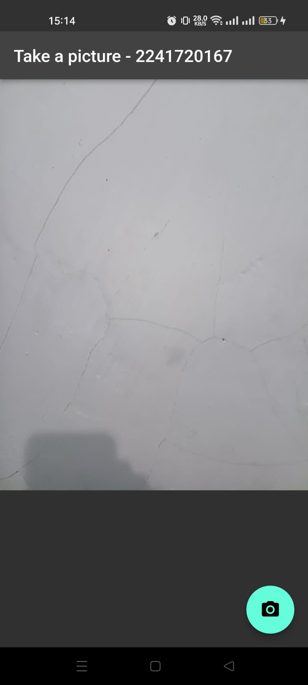

# 09 | Kamera

> Nama : Syahrul Bhudi Ferdiansyah

> Kelas : TI - 3B

> Absen : 26

## Praktikum 1

1. Tambahkan package
   

2. Ambil Sensor Kamera dari device

```dart
WidgetsFlutterBinding.ensureInitialized();

  // Obtain a list of the available cameras on the device.
  final cameras = await availableCameras();

  // Get a specific camera from the list of available cameras.
  final firstCamera = cameras.first;
```

3 - 6 camera controller

```dart
import 'package:camera/camera.dart';
import 'package:flutter/material.dart';
import 'package:kamera_flutter/widget/displaypicture_screen.dart';

// A screen that allows users to take a picture using a given camera.
class TakePictureScreen extends StatefulWidget {
  const TakePictureScreen({
    super.key,
    required this.camera,
  });

  final CameraDescription camera;

  @override
  TakePictureScreenState createState() => TakePictureScreenState();
}

class TakePictureScreenState extends State<TakePictureScreen> {
  late CameraController _controller;
  late Future<void> _initializeControllerFuture;

  @override
  void initState() {
    super.initState();
    // To display the current output from the Camera,
    // create a CameraController.
    _controller = CameraController(
      // Get a specific camera from the list of available cameras.
      widget.camera,
      // Define the resolution to use.
      ResolutionPreset.medium,
    );

    // Next, initialize the controller. This returns a Future.
    _initializeControllerFuture = _controller.initialize();
  }

  @override
  void dispose() {
    // Dispose of the controller when the widget is disposed.
    _controller.dispose();
    super.dispose();
  }

  @override
  Widget build(BuildContext context) {
    return Scaffold(
      appBar: AppBar(title: const Text('Take a picture - 2241720040')),
      // You must wait until the controller is initialized before displaying the
      // camera preview. Use a FutureBuilder to display a loading spinner until the
      // controller has finished initializing.
      body: FutureBuilder<void>(
        future: _initializeControllerFuture,
        builder: (context, snapshot) {
          if (snapshot.connectionState == ConnectionState.done) {
            // If the Future is complete, display the preview.
            return CameraPreview(_controller);
          } else {
            // Otherwise, display a loading indicator.
            return const Center(child: CircularProgressIndicator());
          }
        },
      ),
      floatingActionButton: FloatingActionButton(
        // Provide an onPressed callback.
        onPressed: () async {
          // Take the Picture in a try / catch block. If anything goes wrong,
          // catch the error.
          try {
            // Ensure that the camera is initialized.
            await _initializeControllerFuture;

            // Attempt to take a picture and get the file `image`
            // where it was saved.
            final image = await _controller.takePicture();

            if (!context.mounted) return;

            // If the picture was taken, display it on a new screen.
            await Navigator.of(context).push(
              MaterialPageRoute(
                builder: (context) => DisplayPictureScreen(
                  // Pass the automatically generated path to
                  // the DisplayPictureScreen widget.
                  imagePath: image.path,
                ),
              ),
            );
          } catch (e) {
            // If an error occurs, log the error to the console.
            print(e);
          }
        },
        child: const Icon(Icons.camera_alt),
      ),
    );
  }
}
```

7. Buat widget baru DisplayPictureScreen

```dart
import 'dart:io';
import 'package:flutter/material.dart';

class DisplayPictureScreen extends StatelessWidget {
  final String imagePath;

  const DisplayPictureScreen({super.key, required this.imagePath});

  @override
  Widget build(BuildContext context) {
    return Scaffold(
      appBar: AppBar(title: const Text('Display the Picture - 2241720040')),
      body: Image.file(File(imagePath)),
    );
  }
}
```

8. Edit main.dart

```dart
runApp(
    MaterialApp(
      theme: ThemeData.dark(),
      home: TakePictureScreen(
        // Pass the appropriate camera to the TakePictureScreen widget.
        camera: firstCamera,
      ),
      debugShowCheckedModeBanner: false,
    ),
  );
```

9. Menampilkan hasil foto

```dart
   try {
            // Ensure that the camera is initialized.
            await _initializeControllerFuture;

            // Attempt to take a picture and get the file `image`
            // where it was saved.
            final image = await _controller.takePicture();

            if (!context.mounted) return;

            // If the picture was taken, display it on a new screen.
            await Navigator.of(context).push(
              MaterialPageRoute(
                builder: (context) => DisplayPictureScreen(
                  // Pass the automatically generated path to
                  // the DisplayPictureScreen widget.
                  imagePath: image.path,
                ),
              ),
            );
          } catch (e) {
            // If an error occurs, log the error to the console.
            print(e);
          }
```

10. Hasil
    

## Praktikum 2

1. Buat Project

```bash
  flutter create filter_carousel
  cd filter_carousel
```

2. Buat Widget Selector Ring dan Dark Gradient

   ```dart
   @immutable
   class FilterSelector extends StatefulWidget {
   const FilterSelector({
       super.key,
       required this.filters,
       required this.onFilterChanged,
       this.padding = const EdgeInsets.symmetric(vertical: 24),
   });

   final List<Color> filters;
   final void Function(Color selectedColor) onFilterChanged;
   final EdgeInsets padding;

   @override
   State<FilterSelector> createState() => _FilterSelectorState();
   }

   class _FilterSelectorState extends State<FilterSelector> {
   static const _filtersPerScreen = 5;
   static const _viewportFractionPerItem = 1.0 / _filtersPerScreen;

   late final PageController _controller;
   late int _page;

   int get filterCount => widget.filters.length;

   Color itemColor(int index) => widget.filters[index % filterCount];

   @override
   void initState() {
       super.initState();
       _page = 0;
       _controller = PageController(
       initialPage: _page,
       viewportFraction: _viewportFractionPerItem,
       );
       _controller.addListener(_onPageChanged);
   }

   void _onPageChanged() {
       final page = (_controller.page ?? 0).round();
       if (page != _page) {
       _page = page;
       widget.onFilterChanged(widget.filters[page]);
       }
   }

   void _onFilterTapped(int index) {
       _controller.animateToPage(
       index,
       duration: const Duration(milliseconds: 450),
       curve: Curves.ease,
       );
   }

   @override
   void dispose() {
       _controller.dispose();
       super.dispose();
   }

   @override
   Widget build(BuildContext context) {
       return Scrollable(
       controller: _controller,
       axisDirection: AxisDirection.right,
       physics: const PageScrollPhysics(),
       viewportBuilder: (context, viewportOffset) {
           return LayoutBuilder(
           builder: (context, constraints) {
               final itemSize = constraints.maxWidth * _viewportFractionPerItem;
               viewportOffset
               ..applyViewportDimension(constraints.maxWidth)
               ..applyContentDimensions(0.0, itemSize * (filterCount - 1));

               return Stack(
               alignment: Alignment.bottomCenter,
               children: [
                   _buildShadowGradient(itemSize),
                   _buildCarousel(
                   viewportOffset: viewportOffset,
                   itemSize: itemSize,
                   ),
                   _buildSelectionRing(itemSize),
               ],
               );
           },
           );
       },
       );
   }

   Widget _buildShadowGradient(double itemSize) {
       return SizedBox(
       height: itemSize * 2 + widget.padding.vertical,
       child: const DecoratedBox(
           decoration: BoxDecoration(
           gradient: LinearGradient(
               begin: Alignment.topCenter,
               end: Alignment.bottomCenter,
               colors: [
               Colors.transparent,
               Colors.black,
               ],
           ),
           ),
           child: SizedBox.expand(),
       ),
       );
   }

   Widget _buildCarousel({
       required ViewportOffset viewportOffset,
       required double itemSize,
   }) {
       return Container(
       height: itemSize,
       margin: widget.padding,
       child: Flow(
           delegate: CarouselFlowDelegate(
           viewportOffset: viewportOffset,
           filtersPerScreen: _filtersPerScreen,
           ),
           children: [
           for (int i = 0; i < filterCount; i++)
               FilterItem(
               onFilterSelected: () => _onFilterTapped(i),
               color: itemColor(i),
               ),
           ],
       ),
       );
   }

   Widget _buildSelectionRing(double itemSize) {
       return IgnorePointer(
       child: Padding(
           padding: widget.padding,
           child: SizedBox(
           width: itemSize,
           height: itemSize,
           child: const DecoratedBox(
               decoration: BoxDecoration(
               shape: BoxShape.circle,
               border: Border.fromBorderSide(
                   BorderSide(width: 6, color: Colors.white),
               ),
               ),
           ),
           ),
       ),
       );
   }
   }
   ```

3. Buat Widget Photo Filter Carousel

```dart
   @immutable
   class PhotoFilterCarousel extends StatefulWidget {
   const PhotoFilterCarousel({super.key});

   @override
   State<PhotoFilterCarousel> createState() => _PhotoFilterCarouselState();
   }

   class _PhotoFilterCarouselState extends State<PhotoFilterCarousel> {
   final _filters = [
       Colors.white,
       ...List.generate(
       Colors.primaries.length,
       (index) => Colors.primaries[(index * 4) % Colors.primaries.length],
       )
   ];

   final _filterColor = ValueNotifier<Color>(Colors.white);

   void _onFilterChanged(Color value) {
       _filterColor.value = value;
   }

   @override
   Widget build(BuildContext context) {
       return Material(
       color: Colors.black,
       child: Stack(
           children: [
           Positioned.fill(
               child: _buildPhotoWithFilter(),
           ),
           Positioned(
               left: 0.0,
               right: 0.0,
               bottom: 0.0,
               child: _buildFilterSelector(),
           ),
           ],
       ),
       );
   }

   Widget _buildPhotoWithFilter() {
       return ValueListenableBuilder(
       valueListenable: _filterColor,
       builder: (context, color, child) {
           return Image.network(
           'https://docs.flutter.dev/cookbook/img-files'
           '/effects/instagram-buttons/millennial-dude.jpg',
           color: color.withOpacity(0.5),
           colorBlendMode: BlendMode.color,
           fit: BoxFit.cover,
           );
       },
       );
   }

   Widget _buildFilterSelector() {
       return FilterSelector(
       onFilterChanged: _onFilterChanged,
       filters: _filters,
       );
   }
   }
```

4. Membuat Filter Warna - Bagian 1

```dart
   class CarouselFlowDelegate extends FlowDelegate {
   CarouselFlowDelegate({
       required this.viewportOffset,
       required this.filtersPerScreen,
   }) : super(repaint: viewportOffset);

   final ViewportOffset viewportOffset;
   final int filtersPerScreen;

   @override
   void paintChildren(FlowPaintingContext context) {
       final count = context.childCount;

       final size = context.size.width;

       final itemExtent = size / filtersPerScreen;

       final active = viewportOffset.pixels / itemExtent;

       final min = math.max(0, active.floor() - 3).toInt();

       final max = math.min(count - 1, active.ceil() + 3).toInt();

       for (var index = min; index <= max; index++) {
       final itemXFromCenter = itemExtent * index - viewportOffset.pixels;
       final percentFromCenter = 1.0 - (itemXFromCenter / (size / 2)).abs();
       final itemScale = 0.5 + (percentFromCenter * 0.5);
       final opacity = 0.25 + (percentFromCenter * 0.75);

       final itemTransform = Matrix4.identity()
           ..translate((size - itemExtent) / 2)
           ..translate(itemXFromCenter)
           ..translate(itemExtent / 2, itemExtent / 2)
           ..multiply(Matrix4.diagonal3Values(itemScale, itemScale, 1.0))
           ..translate(-itemExtent / 2, -itemExtent / 2);

       context.paintChild(
           index,
           transform: itemTransform,
           opacity: opacity,
       );
       }
   }

   @override
   bool shouldRepaint(covariant CarouselFlowDelegate oldDelegate) {
       return oldDelegate.viewportOffset != viewportOffset;
   }
   }
```

5. Membuat Filter Warna

```dart
   @immutable
   class FilterItem extends StatelessWidget {
   const FilterItem({
       super.key,
       required this.color,
       this.onFilterSelected,
   });

   final Color color;
   final VoidCallback? onFilterSelected;

   @override
   Widget build(BuildContext context) {
       return GestureDetector(
       onTap: onFilterSelected,
       child: AspectRatio(
           aspectRatio: 1.0,
           child: Padding(
           padding: const EdgeInsets.all(8),
           child: ClipOval(
               child: Image.network(
               'https://docs.flutter.dev/cookbook/img-files/effects/instagram-buttons/millennial-dude.jpg',
               color: color.withOpacity(0.5),
               colorBlendMode: BlendMode.color,
               fit: BoxFit.cover,
               ),
           ),
           ),
       ),
       );
   }
   }
```

6. Implementasi di main.dart

   ```dart
   import 'package:flutter/material.dart';
   import 'package:photo_filter_carousel/widget/filter_carousel.dart';

   void main() {
   runApp(const MyApp());
   }

   class MyApp extends StatelessWidget {
   const MyApp({super.key});

   @override
   Widget build(BuildContext context) {
       return MaterialApp(
       debugShowCheckedModeBanner: false,
       title: 'Photo Filter Carousel',
       theme: ThemeData.dark(),
       home: const PhotoFilterCarousel(),
       );
   }
   }
   ```

## Tugas Kamera

1. Gabungkan hasil praktikum 1 dengan hasil praktikum 2 sehingga setelah melakukan pengambilan foto, dapat dibuat filter carouselnya!

  

2. Jelaskan maksud void async pada praktikum 1?

   > Future<void> menunjukkan bahwa fungsi main() adalah fungsi asinkron yang tidak mengembalikan nilai. Kata kunci async digunakan untuk menandakan bahwa fungsi tersebut dapat menjalankan operasi yang memerlukan waktu (seperti mengakses kamera) tanpa menghentikan eksekusi kode lainnya.

3. Jelaskan fungsi dari anotasi @immutable dan @override ?

   > Anotasi @immutable digunakan untuk menandakan bahwa kelas tersebut bersifat tidak dapat diubah (immutable) setelah objeknya dibuat. Ini berarti, setelah objek dari kelas tersebut dibuat, nilai dari semua propertinya tidak bisa diubah.

   > Anotasi @override digunakan untuk menunjukkan bahwa suatu metode atau getter/setter di kelas anak menggantikan (override) metode atau getter/setter yang ada di kelas induk. Ini memberi tahu kompilator dan pengembang lain bahwa metode tersebut dimaksudkan untuk menggantikan implementasi dari kelas induk.
