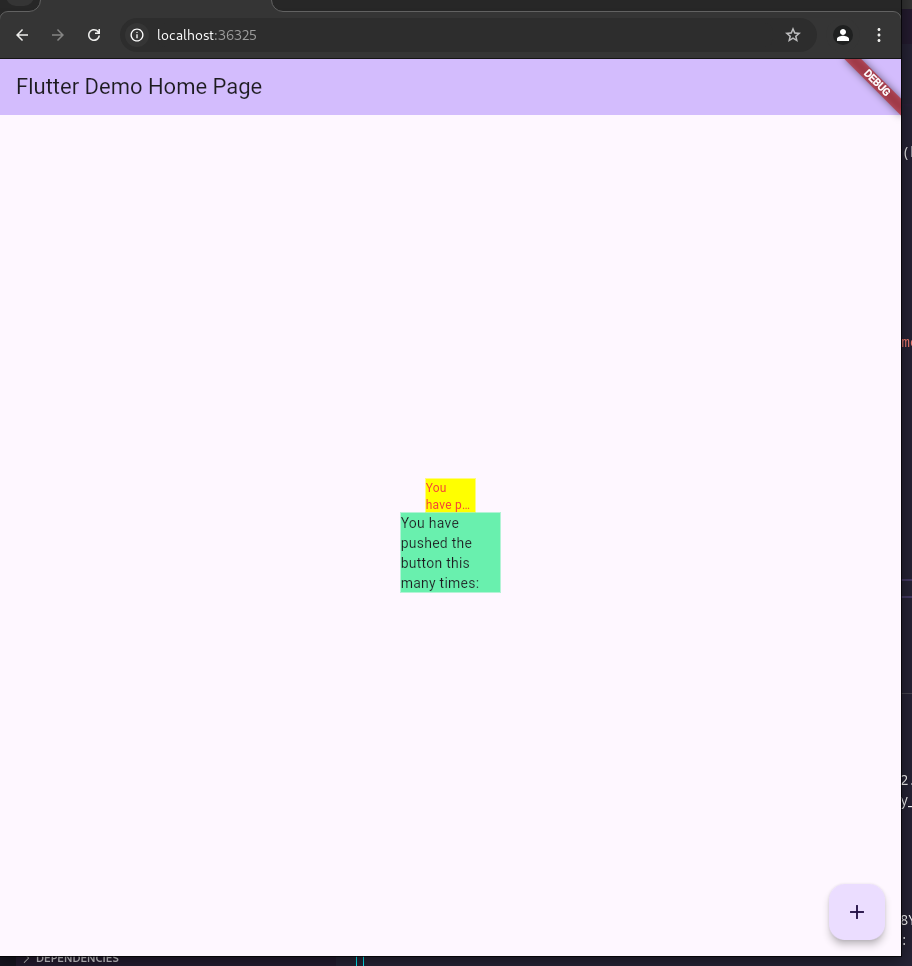

# 07 | Manajemen Plugin

> Nama :Syahrul Bhudi Ferdiansyah

> Kelas :TI - 3B

> Absen :26

## Praktikum Menerapkan Plugin di Project Flutter

1. Buat Project Baru
   

2. Menambahkan Plugin

```bash
flutter pub add auto_size_text
```

3. Buat file red_text_widget.dart

```dart
import 'package:flutter/material.dart';

class RedTextWidget extends StatelessWidget {
  const RedTextWidget({Key? key}) : super(key: key);

  @override
  Widget build(BuildContext context) {
    return Container();
  }
}
```

4. Tambah Widget AutoSizeText

```dart
return AutoSizeText(
      text,
      style: const TextStyle(color: Colors.red, fontSize: 14),
      maxLines: 2,
      overflow: TextOverflow.ellipsis,
);
```

5. Buat Variabel text dan parameter di constructor

```dart
final String text;

const RedTextWidget({Key? key, required this.text}) : super(key: key);
```

6. Tambahkan widget di main.dart

```dart
Container(
   color: Colors.yellowAccent,
   width: 50,
   child: const RedTextWidget(
             text: 'You have pushed the button this many times:',
          ),
),
Container(
    color: Colors.greenAccent,
    width: 100,
    child: const Text(
           'You have pushed the button this many times:',
          ),
),
```



## Tugas Praktikum

1. Jelaskan maksud dari langkah 2 pada praktikum tersebut!
   > Perintah flutter pub add auto_size_text digunakan untuk menambahkan paket auto_size_text ke dalam proyek Flutter kita. Perintah ini secara otomatis akan mengedit file pubspec.yaml dan menambahkan dependensi yang diperlukan, kemudian mengunduh paket tersebut.
2. Jelaskan maksud dari langkah 5 pada praktikum tersebut!
   > Langkah 5 pada praktikum bertujuan untuk mengatasi error "Undefined name text" dengan menambahkan variabel text sebagai properti kelas RedTextWidget dan menjadikannya parameter pada constructor. Ini dilakukan dengan mendeklarasikan text sebagai variabel final dalam kelas dan menambahkannya sebagai parameter required dalam constructor, memastikan bahwa setiap instance dari RedTextWidget harus diberikan nilai text saat diinisialisasi. Hal ini memungkinkan penggunaan properti text di dalam metode build untuk menampilkan teks yang diberikan melalui widget AutoSizeText.
3. Pada langkah 6 terdapat dua widget yang ditambahkan, jelaskan fungsi dan perbedaannya!
   > Kedua Container tersebut digunakan untuk mendemonstrasikan perbedaan dalam menampilkan teks menggunakan dua pendekatan yang berbeda. RedTextWidget dengan AutoSizeText memberikan kemampuan penyesuaian ukuran teks secara otomatis untuk muat dalam ruang yang terbatas atau menyesuaikan dengan ukuran lebar widget sehingga teks akan terpotong, sedangkan widget Text standar menampilkan teks tanpa penyesuaian ukuran otomatis, mengandalkan ruang yang lebih besar agar teks tidak terpotong.
4. Jelaskan maksud dari tiap parameter yang ada di dalam plugin auto_size_text berdasarkan tautan pada dokumentasi ini ! <br>
   | Parameter | Keterangan |
   |-----------|------------|
   | key* | Mengontrol bagaimana satu widget menggantikan widget lain di dalam pohon widget.|
   | textKey | Menetapkan kunci untuk widget Teks yang dihasilkan. |
   | style* | Jika tidak null, gaya yang digunakan untuk teks ini. |
   | minFontSize | Batas ukuran teks minimum yang digunakan saat menyesuaikan ukuran teks secara otomatis. Diabaikan jika presetFontSizes diatur.|
   | maxFontSize | Batas ukuran teks maksimum yang digunakan saat menyesuaikan ukuran teks secara otomatis. Diabaikan jika presetFontSizes diatur. |
   | stepGranularity | Ukuran langkah di mana ukuran font disesuaikan dengan batasan. |
   | presetFontSizes | Menentukan semua ukuran font yang mungkin. Penting: presetFontSizes harus dalam urutan menurun. |
   | group | Menyinkronkan ukuran beberapa AutoSizeText. |
   | textAlign* | Bagaimana teks harus diratakan secara horizontal. |
   | textDirection* | Arah teks. Ini memutuskan bagaimana nilai textAlign seperti TextAlign.start dan TextAlign.end ditafsirkan. |
   | locale* | Digunakan untuk memilih font ketika karakter Unicode yang sama dapat dirender berbeda, tergantung pada lokal. |
   | softWrap* | Apakah teks harus terputus pada jeda baris lunak. |
   | wrapWords | Apakah kata-kata yang tidak muat dalam satu baris harus dibungkus. Default-nya true untuk berperilaku seperti Text. |
   | overflow* | Bagaimana visual overflow harus ditangani. |
   | overflowReplacement | Jika teks meluap dan tidak muat dalam batasnya, widget ini ditampilkan sebagai gantinya. |
   | textScaleFactor* | Jumlah piksel font untuk setiap piksel logis. Juga mempengaruhi minFontSize, maxFontSize, dan presetFontSizes. |
   | maxLines | Jumlah maksimum baris opsional untuk rentang teks. |
   | semanticsLabel\* | Label semantik alternatif untuk teks ini. |
