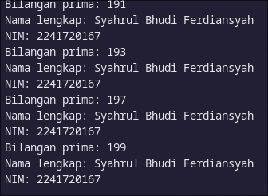

# 03 | Pengantar Bahasa Pemrograman Dart - Bagian 2

> Nama :Syahrul Bhudi Ferdiansyah

> Kelas :TI - 3B

> Absen :26

## Praktikum 1: Menerapkan Control Flows ("if/else")

1. Langkah 1 :

```dart
void main(List<String> args) {
  String test = "test2";
  if (test == "test1") {
    print("Test1");
  } else if (test == "test2") {
    print("Test2");
  } else {
    print("Something else");
  }

  if (test == "test2") print("Test2 again");
}
```

2. Langkah 2 : Eksekusi kode <br>

   

   > Hasilnya adalah Test2 lalu Test2 again di karenakan karena variabel test bernilai test2 yang lalu di cek oleh if else dan masuk ke salah satu kondisi true yang akhirnya melakukan print pada console

3. Langkah 3 :

```dart
String test = "true";
if (test) {
   print("Kebenaran");
}
```

> Error dikarenakan kondisi harus static type of bool yang berarti di dart tidak sama seperti di javascript ataupun php yang mana meski variabel tersebut bukan bool tapi tidak undefined maka ketika dijadikan kondisi if hasilnya tetap true, tapi di dart ternyata hanya menerima bool jadi harus test == "true".

```dart
String test = "true";
  if (test == "true") {
    print("Kebenaran");
  }
```


## Praktikum 2: Menerapkan Perulangan "while" dan "do-while"

1. Langkah 1

```dart
int counter = 0;
  while (counter < 33) {
    print(counter);
    counter++;
  }
```

2. Langkah 2 <br>
   

   > Hasilnya adalah akan melakukan print nilai counter sebanyak 33 kali tapi karena start dari 0 maka print terakhir adalah 32

3. Langkah 3 :

```dart
int counter = 0;
  do {
    print(counter);
    counter++;
  } while (counter < 77);
```


> Intinya hasil printnya sama tetapi flownya beda, jadi statement di perulangan do while paling tidak akan dijalankan 1 kali meski kondisi while tidak terpenuhi

## Praktikum 3: Menerapkan Perulangan "for" dan "break-continue"

1. Langkah 1 :

```dart
for (int index = 10; index < 27; index++) {
    print(index);
  }
```

2. Langkah 2 : <br>


> Karena saya sudah sadar dari awal kalau bakal error dan infinity loop, sudah saya lakukan untuk define variable index menjadi int dan menambahkan increment untuk index

3. Langkah 3 :

```dart
if (index == 21)
      break;
else if (index > 1 || index < 7)continue;
print(index);
```


> Dikarenakan ada kondisi break pada index ke 21 maka perulangan akan berhenti sampai index ke 21 saja, dan juga karena ada kondisi yang selalu true ketika index lebih besar dari 1 atau index kurang dari 7 dengan statement continue maka hasilnya `print(index)` tidak pernah dijalankan

## Tugas Praktikum

1. Buatlah sebuah program yang dapat menampilkan bilangan prima dari angka 0 sampai 201 menggunakan Dart. Ketika bilangan prima ditemukan, maka tampilkan nama lengkap dan NIM Anda.

```dart
String name = "Syahrul Bhudi Ferdiansyah";
  String nim = "2241720167";

  for (int number = 0; number <= 201; number++) {
    if (isPrime(number)) {
      print("Bilangan prima: $number");
      print("Nama lengkap: $name");
      print("NIM: $nim");
    }
  }
}

bool isPrime(int number) {
  if (number <= 1) return false;
  for (int i = 2; i <= number ~/ 2; i++) {
    if (number % i == 0) return false;
  }
  return true;
}
```

- Hasil : <br>
  
