# 05 | Aplikasi Pertama dan Widget Dasar Flutter

> Nama :Syahrul Bhudi Ferdiansyah

> Kelas :TI - 3B

> Absen :26

# Praktikum 1: Membuat Project Flutter Baru

> Gambar diatas menunjukkan cara untuk membuat aplikasi flutter dengan menggunakan command `flutter create <name>`

# Praktikum 2: Menghubungkan Perangkat Android atau Emulator

# Praktikum 3: Membuat Repository GitHub dan Laporan Praktikum

1. Langkah 11:
   Kembali ke VS Code, ubah platform di pojok kanan bawah ke emulator atau device atau bisa juga menggunakan browser
   Chrome. Lalu coba running project hello_world dengan tekan F5 atau Run > Start Debugging. Tunggu proses kompilasi
   hingga selesai, maka aplikasi flutter pertama Anda akan tampil seperti berikut.
   
2. Silakan screenshot seperti pada Langkah 11, namun teks yang ditampilkan dalam aplikasi berupa nama lengkap Anda.
   Simpan file screenshot dengan nama 01.png pada folder images (buat folder baru jika belum ada) di project hello_world
   Anda. Lalu ubah isi README.md seperti berikut, sehingga tampil hasil screenshot pada file README.md. Kemudian push ke
   repository Anda.
   

# Praktikum 4: Menerapkan Widget Dasar

1. Langkah 1: Text Widget
   

2. Langkah 2: Image Widget
   

# Praktikum 5: Menerapkan Widget Material Design dan iOS Cupertino

1. Langkah 1: Cupertino Button dan Loading Bar
   
2. Langkah 2: Floating Action Button (FAB)
   
3. Langkah 3: Scaffold Widget
   1
4. Langkah 4: Dialog Widget
   
5. Langkah 5: Input dan Selection Widget
   
6. Langkah 6: Date and Time Pickers
   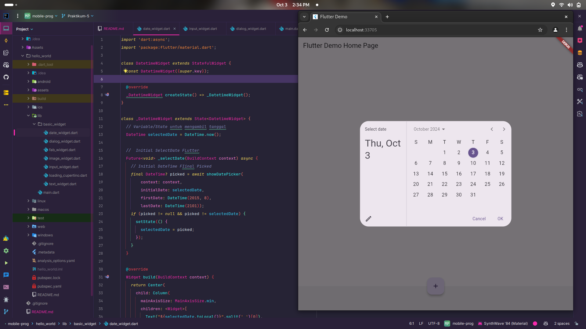

# CODELABS FLUTTER

1. Membuat Project Flutter Baru
   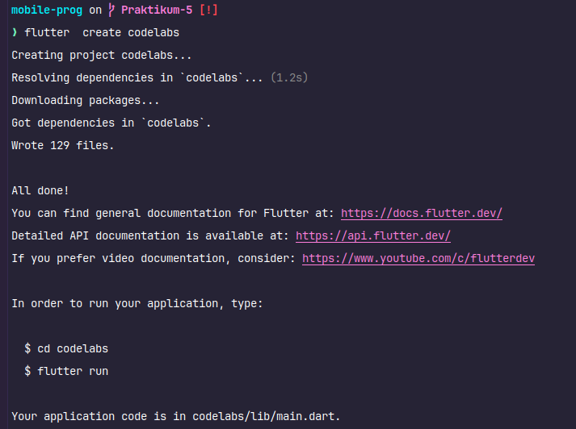
2. Meluncurkan aplikasi
   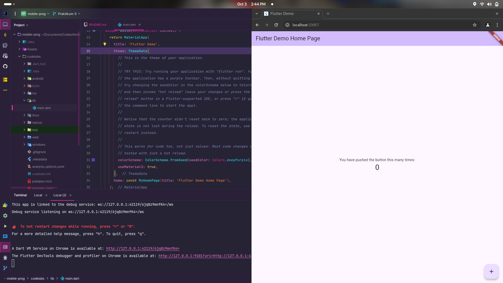
3. Membuat Tombol
   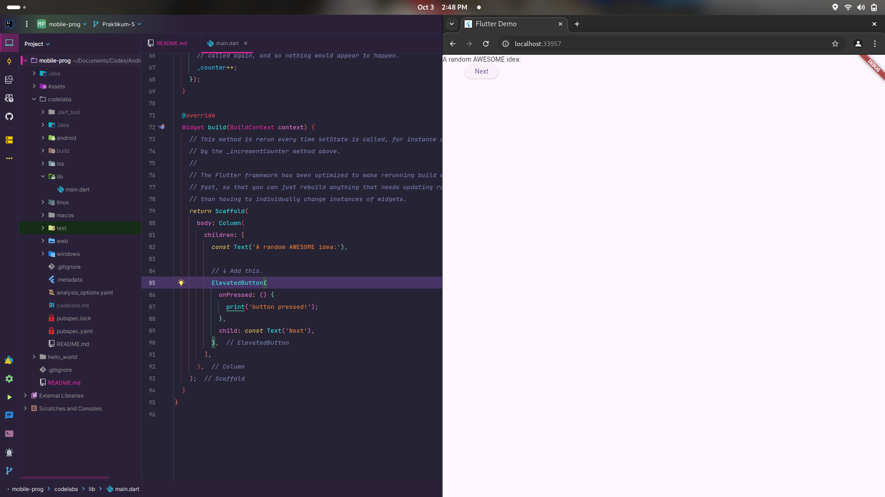
4. First state
   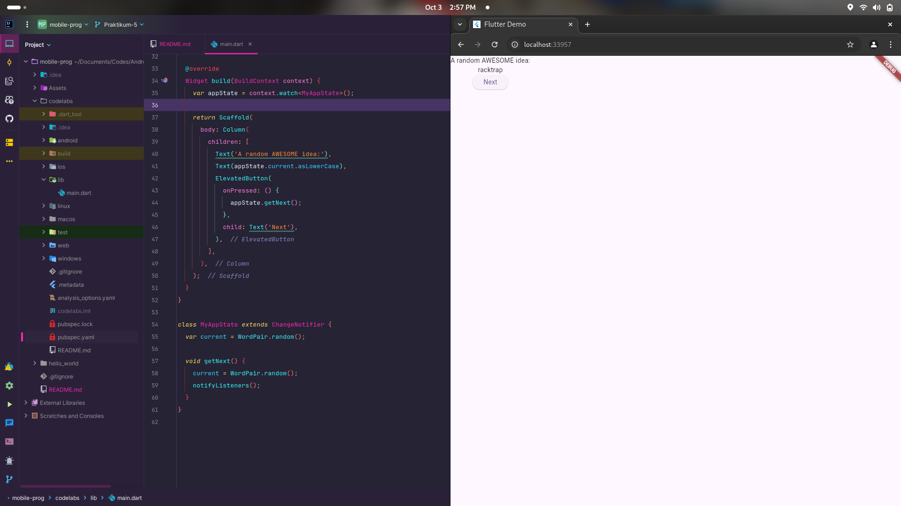
5. Card
   
6. Tema dan gaya
   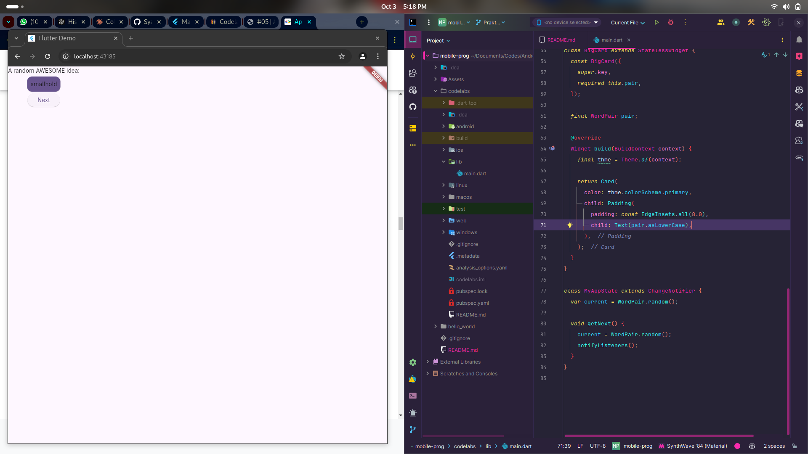
7. TextTheme
   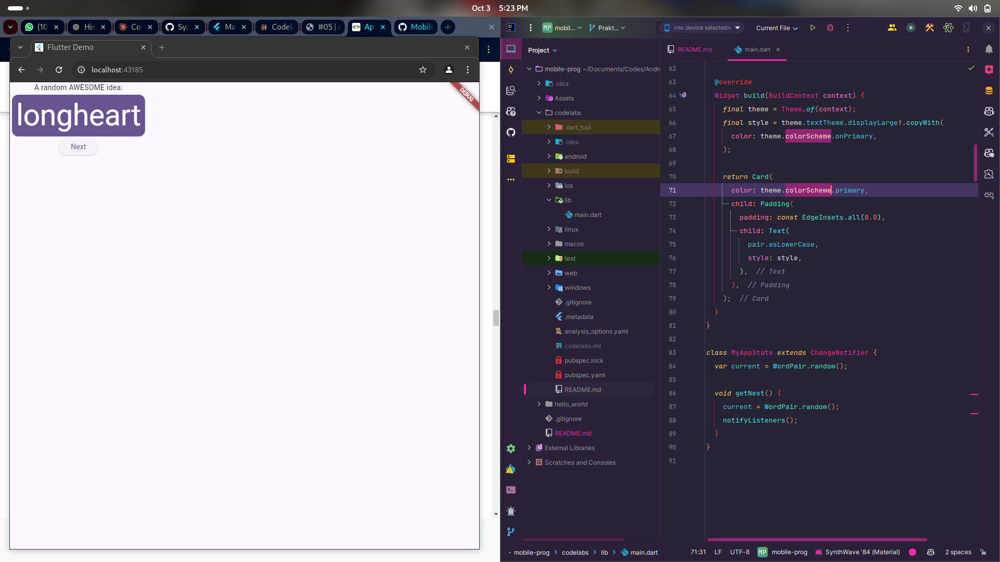
8. Menempatkan UI di tengah
   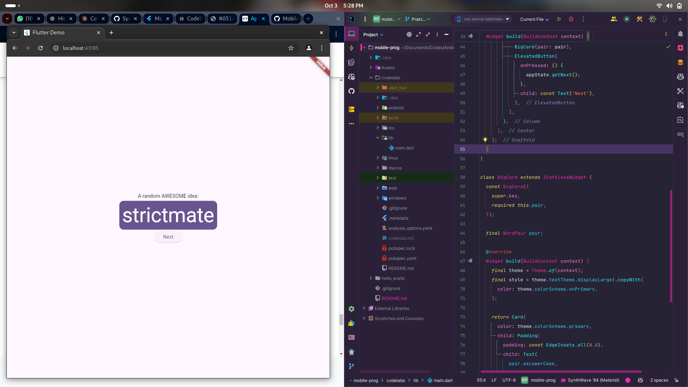
9. Menambahkan fungsi
   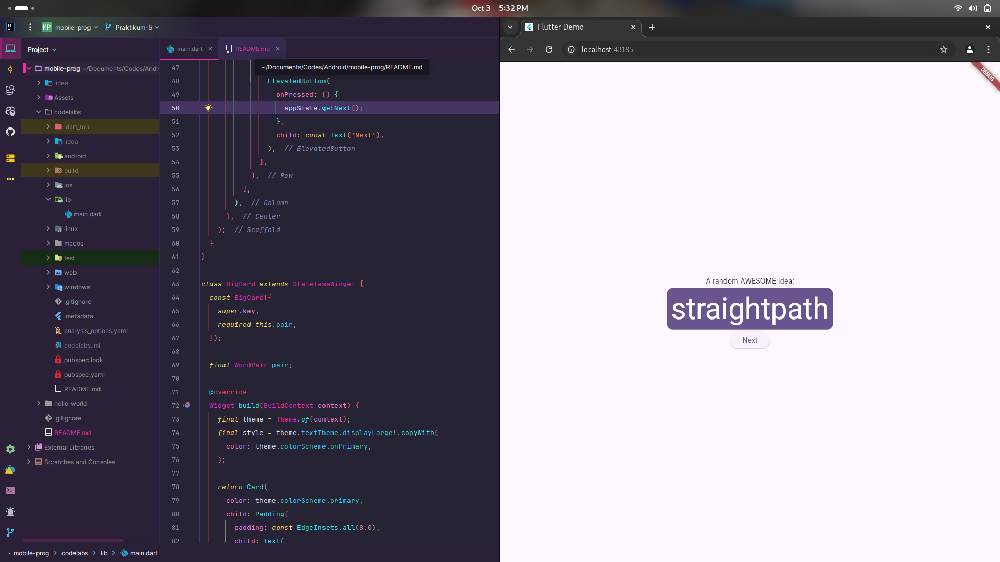
10. Challange tambah button
    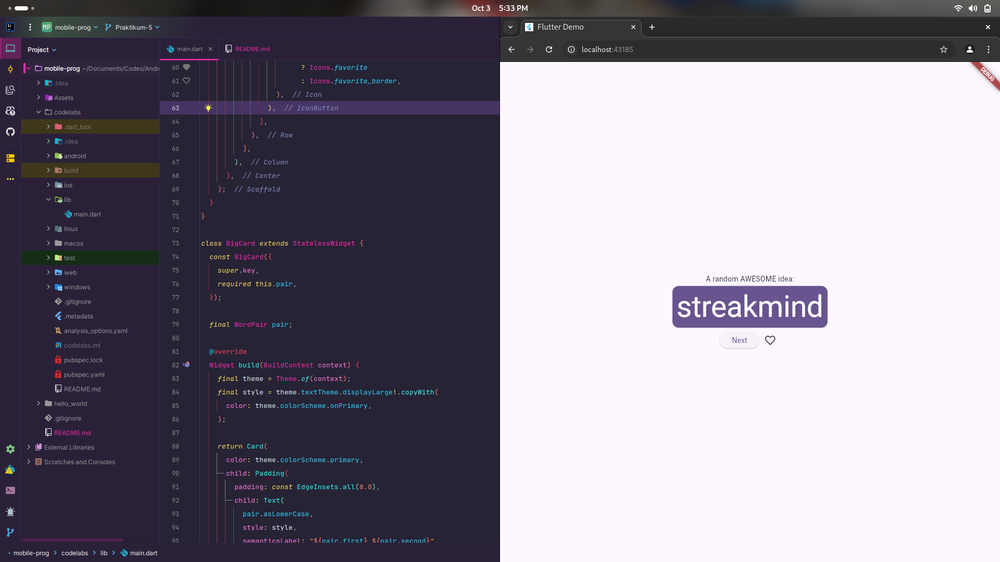
11. Menambahkan kolom samping navigasi
    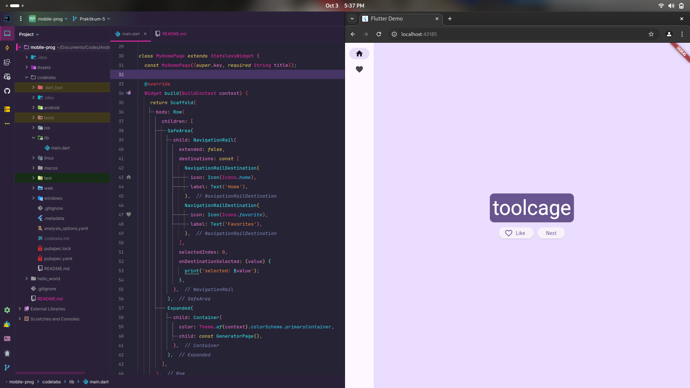
12. Widget stateless versus stateful
    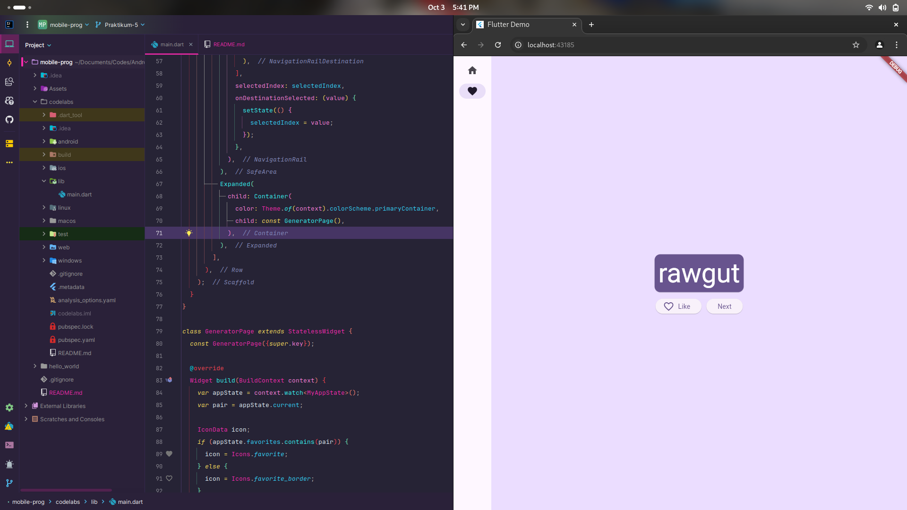
    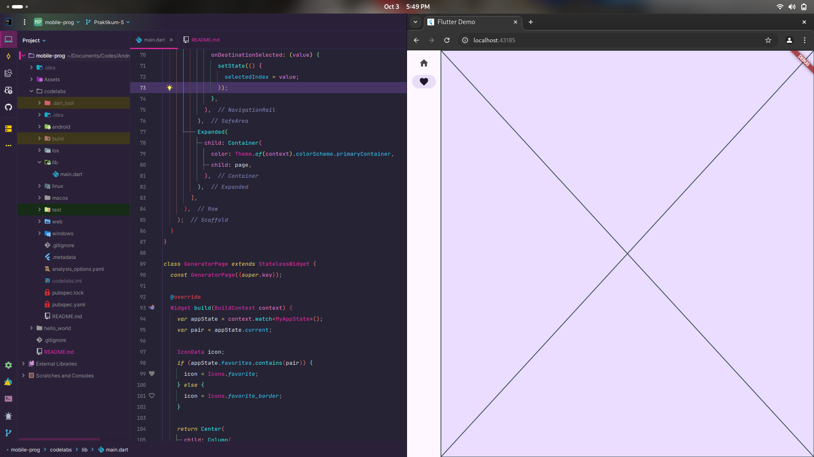
    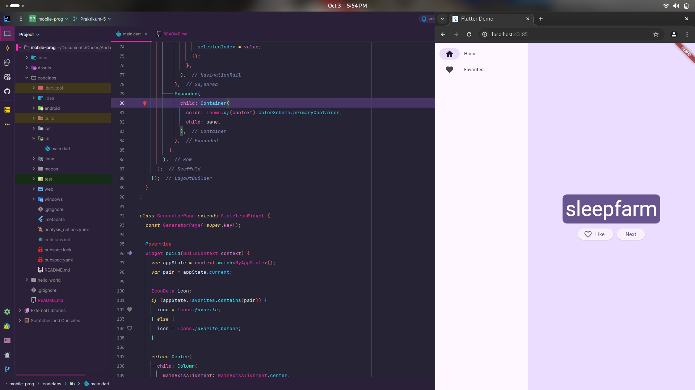
13. Menambahkan halaman baru
    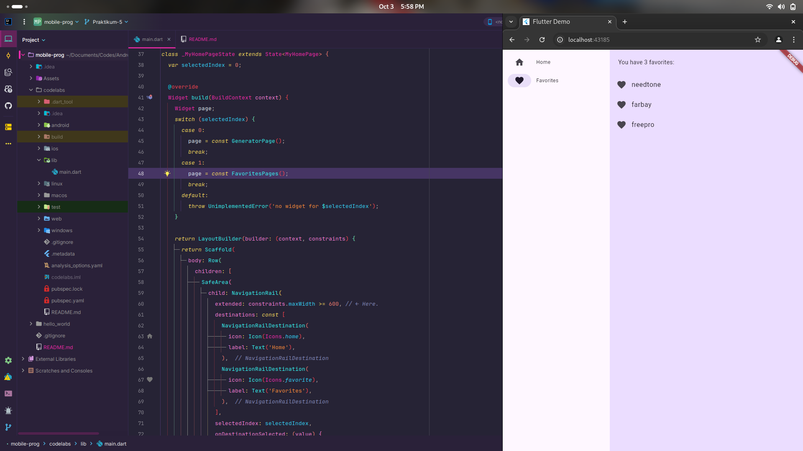

